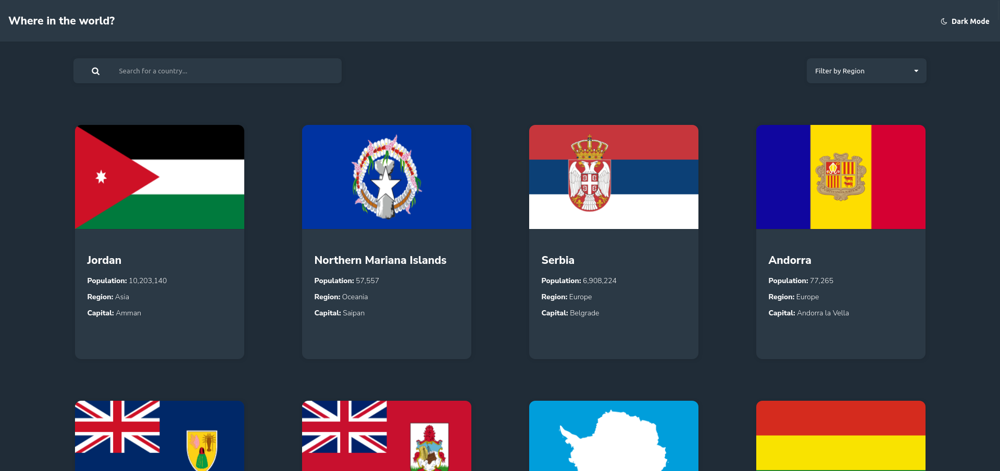

# Frontend Mentor - REST Countries API with color theme switcher solution

This is a solution to the [REST Countries API with color theme switcher challenge on Frontend Mentor](https://www.frontendmentor.io/challenges/rest-countries-api-with-color-theme-switcher-5cacc469fec04111f7b848ca). Frontend Mentor challenges help you improve your coding skills by building realistic projects.

## Table of contents

- [Overview](#overview)
  - [The challenge](#the-challenge)
  - [Screenshot](#screenshot)
  - [Links](#links)
- [My process](#my-process)
  - [Built with](#built-with)
  - [What I learned](#what-i-learned)
  - [Continued development](#continued-development)
- [Author](#author)

## Overview

### The challenge

Users should be able to:

- See all countries from the API on the homepage
- Search for a country using an `input` field
- Filter countries by region
- Click on a country to see more detailed information on a separate page
- Click through to the border countries on the detail page
- Toggle the color scheme between light and dark mode

### Screenshot



### Links

- Live Site URL: [HERE](https://countries-api-sveltekit-2f738f.netlify.app/)

## My process

### Built with

- Semantic HTML5 markup
- CSS custom properties
- Flexbox
- CSS Grid
- Mobile-first workflow
- [Svelte](https://svelte.dev/)
- [SvelteKit](https://kit.svelte.dev/)

### What I learned

Learn more depth of an api, Toggle dark mode and light mode.

This is my favorite journey:

```js
function specificData() {
  for (let i = 0; i < country.length; i++) {
    const languageCode = Object.keys(country[i].name.nativeName)[0];
    const nativeName = country[i].name.nativeName[languageCode].common;

    const currenciesCode = Object.keys(country[i].currencies);
    const currencies = country[i].currencies[currenciesCode]?.name || '-';

    const languages = country[i].languages[languageCode];

    return { nativeName, currencies, languages };
  }
}
```

### Continued development

Im curious with using IntersectionObserver for this challenge, i tried a lot of way, but its does not work.
Also i don't like the way i code the color theme switcher, it does not look good.

## Author

- Frontend Mentor - [@RazaqHimawan](https://www.frontendmentor.io/profile/RazaqHimawan)
- Instagram - [@rou_jacksen](https://www.instagram.com/rou_jacksen/)
